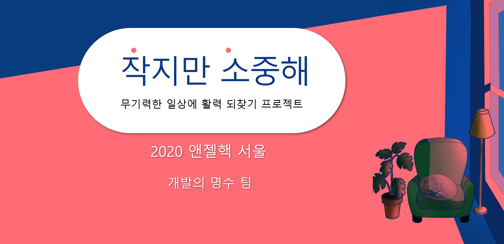
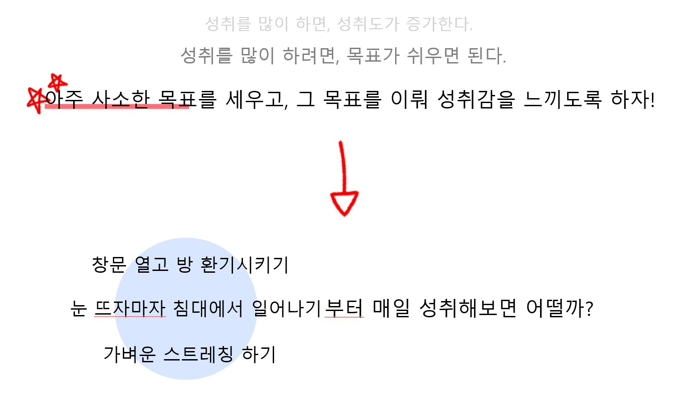
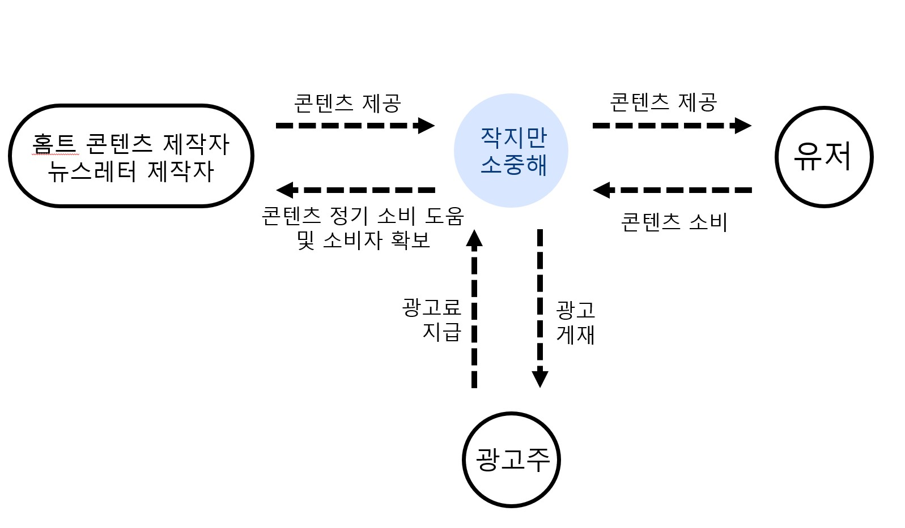

# 작지만 소중해 프로젝트


>  무기력한 일상에 활력 되찾기 프로젝트



<br>

:hash:  *ANGELHACK-SEOUL 2020*

:hash:  *개발의 명수 팀*

:hash:  [*패스트캠퍼스*](https://www.fastcampus.co.kr/)

:hash:  [*커먼컴퓨터*](https://ainize.ai/dashboard)

[](https://littleachievement-tedhoon.endpoint.ainize.ai/)


## 코로나 블루 해결법 💁‍♀️



## 비지니스 모델



# ABOUT DEV 👨‍💻

## branch 👻

|branch|role|
|---|---|
|`master`|루트 & 배포|
|`develop`|개발 중간 저장소|
|`chihun`|backend & frontend|
|`lim`|frontend|
|`tedhoon`|devops|
|`hyerim`|project manage|
|`hyewon`|design & frontend|

## ✔ Commit Message Format 

- [add] 추가한 내용
- [mdf] 수정한 내용
- [del] 지운 내용
- [merge] 병합

```bash
ex) main app 생성 시 
$ git commit -m "[add] main app 생성"
```

## ✔ 협업 가이드라인 

`[개발 단계]`

1. 각자의 branch에서 작업
2. 각자의 branch에서 develop branch에 Pull Request
3. 최소 1명 검열 후 develop branch에서 모든 개발 코드 merge 

`[배포 단계]`

4. develop branch에서 master에 MERGE


